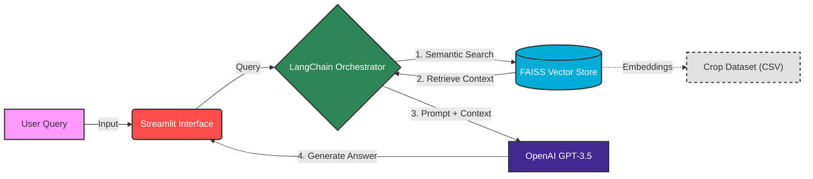

# Agri-Tech Knowledge Retrieval System (RAG Pipeline)

## 📌 Project Overview
This repository implements a **Retrieval-Augmented Generation (RAG)** system designed to provide specialized technical assistance to farmers Unlike generic chatbots, this system is engineered to answer domain-specific queries by retrieving context from a structured agricultural dataset before generating a response.

The system solves the "hallucination" problem of standard LLMs by grounding answers in verified crop data, aiding farmers in making data-driven decisions regarding crop health and management.

## 🏗️ System Architecture
The application utilizes a **RAG (Retrieve, Augment, Generate)** methodology. It bridges the gap between the user interface and the underlying data using LangChain orchestration.

Core Components
Ingestion & Vectorization:

* Uses LangChain CSVLoader to ingest structured crop/disease data.

* Splits text using RecursiveCharacterTextSplitter.

* Generates embeddings via OpenAIEmbeddings and indexes them in FAISS (Facebook AI Similarity Search) for sub-second retrieval.

* Semantic Search (The "Brain"):

* Unlike keyword search (SQL LIKE), FAISS understands intent.

* Example: A query for "yellow leaves" retrieves data about "Nitrogen Deficiency" even if the user never used the specific medical term.

The "Traffic Cop" Router:

* The system analyzes the user's prompt.

* Domain Queries (e.g., "Maize", "Pest"): Routed to the RAG pipeline for strict factual answering.

* General Queries (e.g., "Hello"): Routed to the base LLM for conversational flow.

🚀 Key Features

* Zero Hallucinations: The prompt template strictly enforces: "Answer the question based ONLY on the following context." If the answer isn't in the dataset, the AI admits it rather than guessing.

* Low-Latency Retrieval: FAISS runs locally within the application container, removing the network overhead of external vector DBs for this prototype.

* Cost Optimization: By routing general chat away from the vector store, we save on compute resources and token usage.

🔮 Future Roadmap (Production Scale)

* To scale this from a prototype to an Enterprise Solution (like an Insurance Policy Assistant), the following architectural upgrades are planned:

🔄 Automated Ingestion Pipeline (Airflow):

* Implement Apache Airflow to watch for new document uploads (e.g., new Policy PDFs).

Trigger auto-ingestion and re-indexing so the AI is always up-to-date with the latest regulations.

🔎 Hybrid Search (Pinecone/Weaviate):

* Migrate from FAISS to Pinecone to implement Hybrid Search (combining Semantic Vectors with Keyword BM25).

* Use Case: Ensuring specific Policy IDs (e.g., "POL-992") are matched exactly, while maintaining semantic understanding of coverage terms.

🎙️ Speech-to-Text Integration:

* Integrate OpenAI Whisper to allow farmers (or agents) to ask questions via voice while in the field.

📂 Project Structure

├── app.py                  # Main Streamlit application & routing logic

├── chain_setup.py          # LangChain RAG pipeline & FAISS initialization

├── data/

│   └── AgroQA_Dataset.csv  # Knowledge base (can be swapped for PDFs)

├── requirements.txt        # Python dependencies

└── README.md               # Documentation
