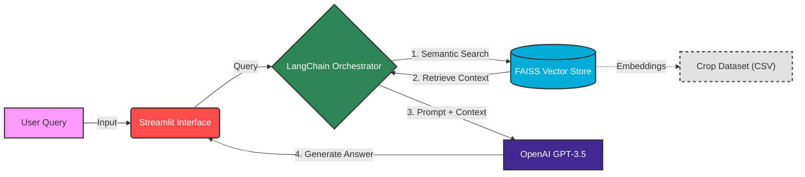

# Agri-Tech Knowledge Retrieval System (RAG Pipeline)

## 📌 Project Overview
[cite_start]This repository implements a **Retrieval-Augmented Generation (RAG)** system designed to provide specialized technical assistance to farmers[cite: 7]. [cite_start]Unlike generic chatbots, this system is engineered to answer domain-specific queries by retrieving context from a structured agricultural dataset before generating a response[cite: 4, 5].

[cite_start]The system solves the "hallucination" problem of standard LLMs by grounding answers in verified crop data, aiding farmers in making data-driven decisions regarding crop health and management[cite: 8].

## 🏗️ System Architecture
[cite_start]The application utilizes a **RAG (Retrieve, Augment, Generate)** methodology[cite: 20]. It bridges the gap between the user interface and the underlying data using LangChain orchestration.

🚀 Key Engineering Features

Vector Search & Embeddings: Utilizes FAISS (Facebook AI Similarity Search) to index agricultural data, enabling high-performance semantic search rather than simple keyword matching.

Prompt Engineering: Implements custom prompt templates to instruct the OpenAI GPT-3.5 model to prioritize retrieved context over general knowledge.

Hybrid Query Logic:

Domain Queries: If the input relates to crops, the system retrieves specific answers from the dataset.

General Queries: Falls back to the base LLM capabilities for non-technical conversation.

Interactive UI: Deployed using Streamlit for a responsive, low-latency user experience.

🛠️ Tech Stack

LLM: OpenAI GPT-3.5 

Orchestration: LangChain 

Vector Database: FAISS 

Data Source: Kaggle Agricultural Dataset (CSV: Question/Answer/Crop) 

Frontend: Streamlit 
Launch App

Bash

streamlit run app.py
